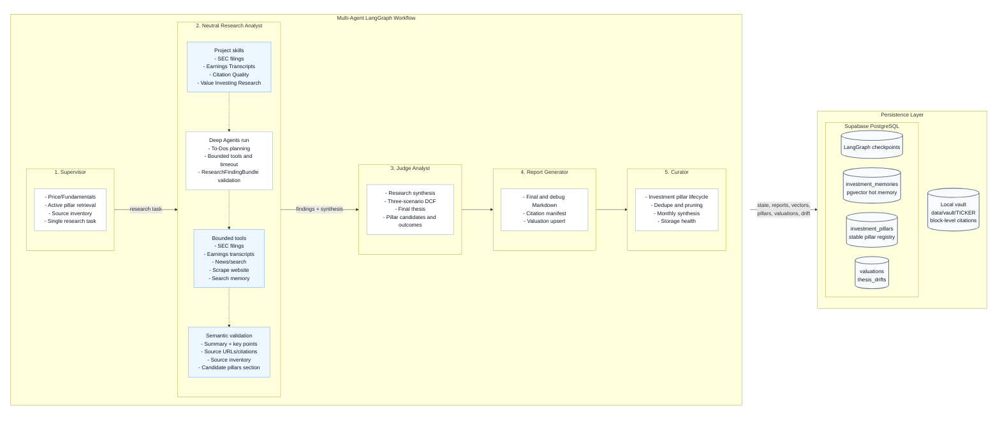
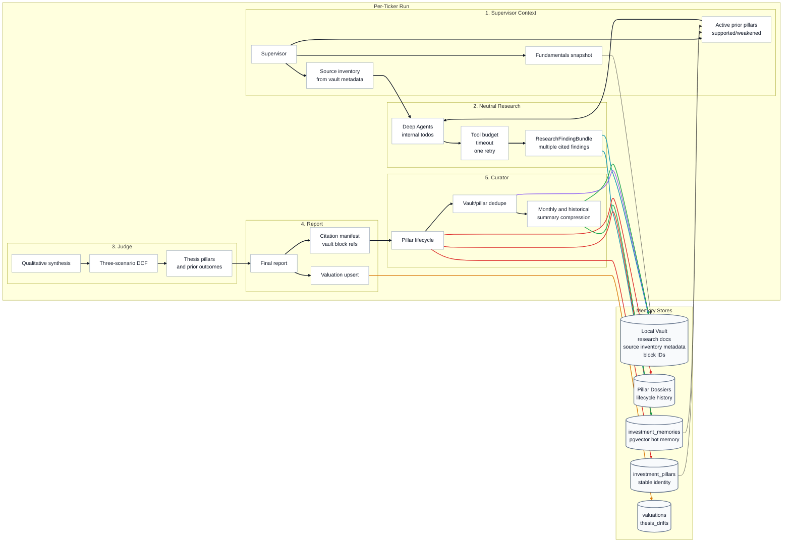

# Value Brief

Value Brief: Covering your assets. An automated daily digest that accumulates insights on your assets and tracks intrinsic value, margin of safety, and portfolio fundamentals.

## Why It Exists

**The Problem:** Rigorous fundamental analysis requires hours of manual data aggregation and modeling. Meanwhile, standard automated stock screeners lack the nuanced qualitative synthesis needed to determine a true margin of safety.

**The Solution:** Value Brief is an automated daily digest that acts as a personal team of investment analysts. By bridging the gap between generative AI and deterministic financial modeling, it translates complex, time-intensive research workflows into a streamlined pipeline that delivers actionable, fundamental-driven investment theses.

## Agent Architecture

Value Brief is powered by a LangGraph workflow with durable Supabase PostgreSQL checkpointing. The current production path uses one bounded neutral Deep Agents research run per ticker, then hands the evidence to valuation, reporting, and memory-curation stages.

- **Supervisor**: Validates ticker inputs, fetches market and fundamental data, writes a fundamentals snapshot to the vault, retrieves active prior thesis pillars, loads source inventory from the vault, and creates one synthetic `deep_agent_research` task when fresh research is needed.
- **Neutral Research Analyst (Deep Agents)**: Runs a single Deep Agents session per ticker. Deep Agents owns internal planning through its todo list while the application provides the research goal, required deliverables, project skills, tools, budgets, timeout, and output contract.
  - **Research Tools**: The research agent can fetch SEC filings, discover earnings-call transcripts, search news and the web, scrape high-value pages, and search prior investment memories. Tool calls are bounded by `RESEARCH_MAX_TOOL_CALLS`, `RESEARCH_MAX_SEARCH_CALLS`, and `RESEARCH_MAX_SCRAPE_CALLS`.
  - **Output Validation**: Research must return a `ResearchFindingBundle` with multiple cited findings, a structured source inventory when relevant, and a synthesis section containing `Candidate Investment Pillars`. Invalid output is retried once, then converted into a blocked finding for improvement.
- **Judge Analyst**: Consumes research findings and synthesis, produces qualitative synthesis, derives a three-scenario DCF with `ValuationModel`, reconciles the thesis, and creates current thesis pillar candidates plus outcomes for prior pillars.
- **Report Generator**: Writes final and debug Markdown reports, persists the final report to the vault, builds a citation manifest from vault block references, and upserts the latest valuation to Supabase.
- **Curator**: Owns post-run memory maintenance. It persists new or revised thesis pillars, updates prior pillar lifecycles, consolidates near-duplicates, prunes stale non-pillar vectors, tracks thesis drift, deduplicates vault files, creates monthly syntheses, and monitors vector storage pressure.

The older Bull and Bear analyst subgraphs still exist in `src/agents/orchestration.py` as reusable side-analyst components, but `build_research_workflow()` currently wires the neutral Deep Agents research path.

### Workflow Visualisation



## Sample Output Report

> Completed: 2026-04-12T01:06:59.965264

### Investment Report: Generic Corp (GNC)

### Investment Thesis

**Verdict** — Strong Buy on weakness, targeting a probability-weighted intrinsic value of approximately $408 per share.

**Rationale** — Generic Corp’s core investment case remains anchored in its entrenched enterprise workflow dominance and commercially indemnified AI architecture... the qualitative reality points to a deliberate monetization pivot from volume-based subscriptions to value-driven AI credit consumption. The current disconnect between Generic Corp’s durable cash generation and its compressed valuation multiple represents a classic transitional mispricing.

### Key Risks

- Accelerated enterprise seat consolidation outpacing AI credit monetization.
- Prolonged leadership vacuum delaying strategic capital allocation.
- Competitive disruption from AI-native platforms capturing mid-market share.

### DCF Valuation

| Scenario | Probability | Intrinsic Value | Margin of Safety |
| :------- | :---------- | :-------------- | :--------------- |
| Bear     | 25%         | $225.56         | -10.1%           |
| **Base** | **50%**     | **$380.93**     | **34.8%**        |
| Bull     | 25%         | $643.82         | 61.4%            |

**Expected Intrinsic Value:** $407.81  
**Current Price:** $248.39  
**Expected 5-Year CAGR:** 16.4%  
**Recommendation:** Strong Buy

---

## 🔗 Sources

- https://example.com/financials/gnc
- https://example.com/news/gnc-upgrades

---

## Insight Lifecycle Management

Value Brief maintains a pillar-first knowledge store that grows smarter with each run. Fresh research is written to a **local Markdown vault** for auditability and citation, while Supabase stores workflow checkpoints, valuation history, stable pillar identity, and compact vector-search rows. Research findings can be embedded as short-lived evidence, but the durable retrieval unit is the curated thesis pillar.

### Memory Architecture

| Layer                          | Storage                                                                                 | Purpose                                                                                                        | Retention / Lifecycle                                      |
| :----------------------------- | :-------------------------------------------------------------------------------------- | :------------------------------------------------------------------------------------------------------------- | :--------------------------------------------------------- |
| **Workflow Checkpoints**       | LangGraph checkpoint tables in Supabase PostgreSQL                                      | Durable run state, resume support, and crash recovery                                                          | Managed by `AsyncPostgresSaver.setup()`                    |
| **Vault** (cold)               | `data/vault/{TICKER}/`                                                                  | Full Markdown audit trail for fundamentals, research findings, judge analysis, final reports, and source URLs  | Indefinite, content-hash deduplicated, old files archived  |
| **Pillar Dossiers**            | `data/vault/{TICKER}/pillars/{pillar_id}.md`                                            | Human-readable lifecycle record for each durable thesis pillar                                                 | Historical dossier retained even when pillar is inactive   |
| **Vector Memory** (hot)        | `investment_memories` with 1536-dim embeddings from `text-embedding-3-small` by default | Semantic retrieval for active thesis pillars, temporary research evidence, monthly summaries, historical summaries | Actively pruned and compressed                             |
| **Pillar Registry**            | `investment_pillars`                                                                    | Stable pillar identity, status, current vector pointer, version, and dossier citation                          | Current and historical pillar identities                   |
| **Valuation and Drift History** | `valuations`, `thesis_drifts`                                                           | Latest DCF valuation, prior thesis context, and run-over-run verdict/value changes                             | One latest valuation per ticker plus drift event history   |
| **SEC Lookup Cache**           | SEC company ticker table from `scripts/04-sec_company_tickers_ddl.sql`                  | Fast CIK lookup for filing retrieval                                                                           | Refreshable reference data                                 |

Apply `scripts/01-investment_memories_ddl.sql` for vector memory, `scripts/03-investment_pillars_ddl.sql` for pillar identity, and `scripts/04-sec_company_tickers_ddl.sql` for SEC ticker lookup support.

### Memory Visualisation



### Lifecycle Stages

#### 1. Supervisor Context — Every Run

- The Supervisor fetches price/fundamental data via Alpha Vantage and yfinance.
- A fundamentals snapshot is written to `data/vault/{TICKER}/`.
- Source inventory is rebuilt from vault metadata and prior `source_inventory_records`.
- Active prior pillars are retrieved through `retrieve_active_pillars()`, primarily via `investment_pillars.current_memory_id` joined to `investment_memories`.
- Only `supported` and `weakened` pillars are normal retrieval candidates; `contradicted`, `superseded`, and `stale` pillars remain in history but are excluded from the default research context.

#### 2. Neutral Research — Every Run

- The Supervisor creates one `deep_agent_research` task. There is no outer queue of deterministic granular tasks.
- Deep Agents receives the full research goal, prior pillar context, known source inventory, and required deliverables.
- Project skills are seeded under `/skills/`, including SEC filings, earnings transcripts, citation quality, and value-investing research guidance.
- Research tools share a per-run budget. Exhausted tools return a controlled "budget exhausted; synthesize now" message instead of allowing an unbounded search loop.
- Output must parse as `ResearchFindingBundle`. Semantic validation requires non-empty summaries, key points, source URLs or vault citations, and structured source inventory for source-discovery findings.
- Valid findings are persisted to the vault and vectorized as evidence rows. If the run times out or stays malformed after one retry, a blocked finding is persisted instead of a low-quality artifact.

#### 3. Judge Synthesis and Valuation

- The Judge synthesizes the neutral findings and research synthesis.
- The valuation step asks for DCF assumptions only; `ValuationModel.compute_dcf()` calculates intrinsic values deterministically.
- The reconcile step produces the final thesis text plus JSON for:
  - `thesis_pillars`: current active pillar candidates.
  - `pillar_outcomes`: lifecycle decisions for previously retrieved pillars.
- Stable pillar IDs are assigned by the system and vector-memory layer, not by the research agent.

#### 4. Report and Citation Manifest

- The Report Generator writes debug and final Markdown reports.
- The final report is persisted to the vault with source URL metadata.
- `build_citation_manifest()` resolves inline vault references such as `(See: file.md#^block-id)` so the Curator can connect report claims back to source paragraphs.
- The latest valuation is upserted to Supabase for future prior-valuation context.

#### 5. Curation — Every Run

After the report is generated, the Curator performs outcome-aware memory maintenance:

1. **Persist New/Revised Pillars**: Current thesis pillar candidates are embedded, written to pillar dossiers, inserted into `investment_memories` with `source_type = "thesis_pillar"`, and registered in `investment_pillars`.
2. **Process Prior Outcomes**: `supported` pillars are marked cited; `weakened` pillars remain active but get `validity_status = "weakened"`; `revised` pillars are superseded once a replacement vector exists; `contradicted` and `stale` pillars are demoted out of normal retrieval.
3. **Consolidate Duplicate Pillars**: Near-duplicate active pillars of the same type can be merged, with the duplicate marked `superseded` and its dossier updated.
4. **Prune Non-Pillar Vectors**: Old uncited non-pillar memories are removed after the consolidation cutoff. Pillars are managed by lifecycle status rather than simple age.
5. **Record Thesis Drift**: The latest judge decision and expected value are compared with prior valuation context and stored in `thesis_drifts`.
6. **Deduplicate Vault Files**: Duplicate Markdown files with identical content hashes are removed, preserving the earliest file.

#### 6. Consolidation — Monthly

When vault files for a ticker exceed `CONSOLIDATION_CUTOFF_DAYS` (default 90 days), the Curator triggers consolidation:

- Groups vault files by month (`{YYYY-MM}`).
- Feeds each month's documents to the **curator LLM**, which synthesizes them into a structured `{YYYY-MM}_synthesis.md` file stored in the vault.
- Archives the original source files (marks them `archived: true` in frontmatter).
- **Atomic vector swap**: deletes all granular vector memories for that month and inserts a single summary vector with `source_priority = 2` and `is_cited = true`.

This ensures the vector index stays lean while preserving the full audit trail in cold storage.

#### 7. Summary Deduplication and Aggressive Pruning

- Near-duplicate monthly and historical summary vectors are merged when they exceed the configured similarity threshold.
- When the `investment_memories` table exceeds the aggressive threshold (default 80% of 500 MB), the Curator identifies older monthly summary vectors, merges them via the curator LLM into broader historical summaries, and retains only the **3 most recent months** of monthly summary vectors.
- Aggressive pruning is an emergency mechanism; normal operation should rely on pillar lifecycle, non-pillar pruning, and monthly consolidation.

### Citation & Outcome System

Value Brief uses a lightweight file-based citation scheme combined with Judge-assigned pillar outcomes to maintain a self-correcting vector memory:

- **In the vault**: Every paragraph in a Markdown document is tagged with a block ID: `^block-a1b2c3d4`.
- **In the report**: Agents reference sources inline using the pattern `(See: 2026-05-02_a1b2c3d4.md#^block-a1b2c3d4)`.
- **Research findings**: Deep Agents findings must carry source URLs or vault citations. Source-discovery findings must also include structured `SourceInventoryRecord` entries.
- **Pillar outcomes**: The Judge assigns every retrieved prior pillar one of `supported`, `weakened`, `revised`, `contradicted`, or `stale`.
- **At curation time**: The Curator keeps `supported` and `weakened` pillars active, turns revised prior rows into `superseded` rows once replacements exist, and excludes `contradicted`, `superseded`, and `stale` pillars from normal retrieval without deleting their local dossiers.
- **Retrieval feedback loop**: Future runs retrieve active thesis pillars, not every historical paragraph vector. Old research evidence can still exist in the vault, while the hot retrieval surface stays compact and thesis-oriented.

This creates a **provenance chain with outcome feedback**: report assertion → block ID → vault paragraph → vector embedding → Judge outcome → curation decision → future retrieval quality.

## Getting Started

### Prerequisites

| Requirement                      | Version                                 |
| :------------------------------- | :-------------------------------------- |
| Python                           | `>= 3.14`                               |
| [uv](https://docs.astral.sh/uv/) | latest                                  |
| Supabase project                 | PostgreSQL (transaction pooler enabled) |
| LLM provider account             | OpenRouter / Google / Others            |

### 1. Clone the repository

```bash
git clone https://github.com/your-username/valuebrief.git
cd valuebrief
```

### 2. Install dependencies

Value Brief uses [`uv`](https://docs.astral.sh/uv/) for fast, reproducible dependency management.

```bash
# Install uv if you don't have it
curl -LsSf https://astral.sh/uv/install.sh | sh

# Create the virtual environment and install all dependencies
uv sync
```

This resolves dependencies from `pyproject.toml` and the pinned `uv.lock` file.

### 3. Configure environment variables

Copy the example file and fill in your credentials:

```bash
cp .env-example .env
```

Edit `.env` with the following values:

| Variable                     | Description                                                   |
| :--------------------------- | :------------------------------------------------------------ |
| `SUPABASE_CONNECTION_STRING` | Your Supabase PostgreSQL transaction-pooler connection string |
| `GOOGLE_API_KEY`             | Google Gemini API key (if using `langchain-google-genai`)     |
| `DEEPSEEK_API_KEY`           | DeepSeek API key                                              |
| `OPENROUTER_API_KEY`         | OpenRouter API key (used as the default provider)             |
| `ALPHAVANTAGE_API_KEY`       | Alpha Vantage key for financial data                          |
| `LANGSMITH_API_KEY`          | LangSmith key for tracing (optional but recommended)          |
| `*_PROVIDER` / `*_MODEL`     | Per-agent LLM provider and model overrides                    |
| `RESEARCH_TIMEOUT_SECONDS`   | Wall-clock timeout for the neutral Deep Agents research run   |
| `RESEARCH_MAX_TOOL_CALLS`    | Total research tool-call budget per ticker                    |
| `RESEARCH_MAX_SEARCH_CALLS`  | Search/news/transcript discovery budget per ticker            |
| `RESEARCH_MAX_SCRAPE_CALLS`  | Web-scrape budget per ticker                                  |

> **Tip:** Each active agent role (Research, Judge, Supervisor, Report Generator, Valuation, Curator) has its own `_PROVIDER`, `_MODEL`, and `_TEMPERATURE` variable.
>
> Strong reasoning and reliable tool calling matter most for **Research** and **Judge**. DeepSeek thinking mode is supported through `deepseek-v4-pro` plus `RESEARCH_THINKING=true`; plain `deepseek-reasoner` is avoided for tool-using workflows because it does not support the forced `tool_choice` path used by some structured-output integrations.

### 4. Set up your portfolio

Create a `portfolio.json` file in the project root listing the tickers you want to track.

**International Stocks:** Use the [Yahoo Finance convention](https://help.yahoo.com/kb/finance-for-web/SLN2310.html) (`TICKER.EXCHANGE`) for all tickers.

```json
{
  "tickers": ["AAPL", "MZH.SI", "9988.HK", "RY.TO"]
}
```

#### Exchange Mappings (Alpha Vantage)

Since Alpha Vantage uses different exchange suffixes than Yahoo Finance, Value Brief uses a mapping file to translate them during data retrieval. You can customise these mappings in `exchange_mappings.json`:

```json
{
  "yahoo_to_alphavantage": {
    ".SI": ".SIN",
    ".HK": ".HKG",
    ".TO": ".TRT"
  }
}
```

> [!NOTE]
> Alpha Vantage often lacks fundamental data (`OVERVIEW`) for international stocks. In such cases, Value Brief automatically falls back to `yfinance` to ensure your report remains complete.

See `example-portfolio.json` for reference.

### 5. Initialise the database

The LangGraph checkpointer tables are created automatically on first run via `AsyncPostgresSaver.setup()`. Ensure your Supabase connection string points to a **transaction-pooler** endpoint (port `6543`) with `autocommit` enabled.

Apply the repository DDL scripts for the RAG and lookup tables:

```bash
psql "$SUPABASE_CONNECTION_STRING" -f scripts/01-investment_memories_ddl.sql
psql "$SUPABASE_CONNECTION_STRING" -f scripts/03-investment_pillars_ddl.sql
psql "$SUPABASE_CONNECTION_STRING" -f scripts/04-sec_company_tickers_ddl.sql
```

### 6. Run Value Brief

```bash
# Analyse tickers from portfolio.json
uv run python src/main.py

# Override tickers inline
uv run python src/main.py --tickers NVDA TSM ASML

# Point to a custom portfolio file
uv run python src/main.py --portfolio my-watchlist.json
```

Generated Markdown reports are written to the `logs/` directory.

### Scheduling (optional)

To run Value Brief as a daily digest, add a cron job:

```bash
# Example: run at 07:00 every day
0 7 * * * cd /path/to/valuebrief && uv run python src/main.py >> logs/cron.log 2>&1
```
