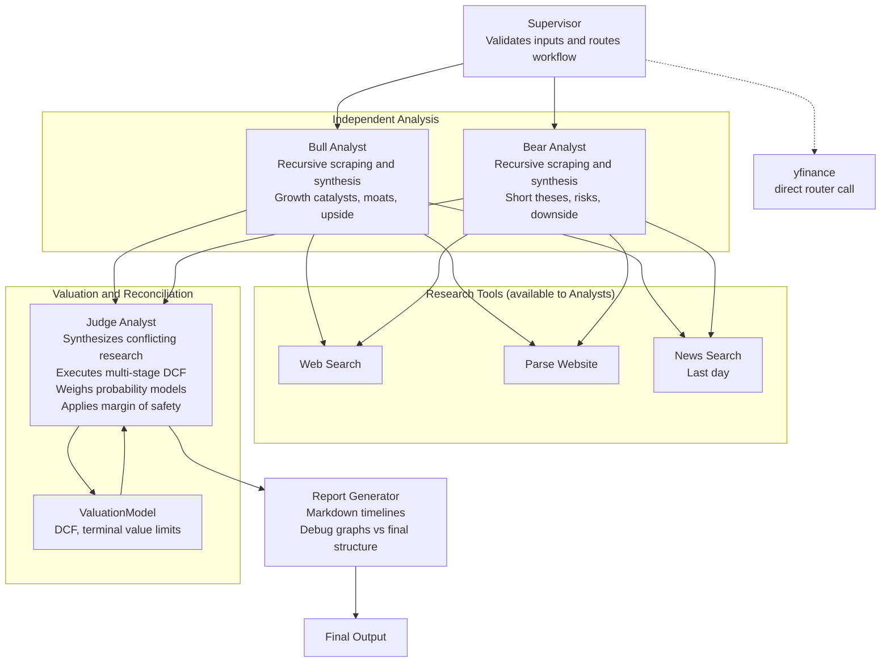

# Value Brief

Value Brief: Covering your assets. An automated daily digest tracking intrinsic value, margin of safety, and portfolio fundamentals.

## Architecture

Value Brief is powered by an agentic research workflow orchestrated by LangGraph. It relies on specialised AI agents that operate iteratively and securely maintain state using Supabase PostgreSQL as a checkpointer.

- **Supervisor**: Controls workflow routing, validates inputs, and ensures all research parameters.
- **Bull Analyst**: Operates standalone with recursive web scraping and research tooling to synthesise growth catalysts, competitive moats, and upside cases.
- **Bear Analyst**: Utilizes matching toolsets independently to extract short theses, highlight speculative risks, downside scenarios, and mapping margin issues.
- **Judge Analyst**: Synthesizes conflicting fundamental researches, and leverages a configured `ValuationModel` to execute a multi-stage Discounted Cash Flow (DCF). Weighs probability models (Bear/Base/Bull), terminal value limits, and produces a reconciled final decision based strictly on margin of safety.
- **Report Generator**: Reconciles the output into isolated Markdown timelines (with segmented debug graphs vs presentation-ready final structures).

### Visualisation

## Sample Output Report

> Completed: 2026-04-12T01:06:59.965264

══════════════════════════════════════════════════
INVESTMENT REPORT: Generic Corp (GNC)
══════════════════════════════════════════════════

BULL THESIS:
Generic Corp demonstrates formidable runway through aggressive multi-stage scaling. Expanding gross margins align flawlessly with their cloud software transitions alongside impressive ARR retention metrics...

BEAR THESIS:
Despite current revenue bumps, mounting CapEx costs risk sinking free cash flow profiles dramatically if enterprise uptake falters amidst tightened macroeconomic cycles...

JUDGE DECISION:
Generic Corp sits at a reasonable discount with significant margin of safety. Current speculative headwinds offer favourable asymmetry despite near-term volatility...

──────────────────────────────────────────────────
DCF VALUATION
──────────────────────────────────────────────────

**Expected Base CAGR:** ~ 12.3%  
**Recommended Strategy:** Buy

### Final Intrinsic Value Spread

| Scenario | Probability | Intrinsic Value | vs Market Price |
| -------- | ----------- | --------------- | --------------- |
| Bear     | 20.0%       | $ 85.00         | -15.0%          |
| Base     | 60.0%       | $ 115.00        | +15.0%          |
| Bull     | 20.0%       | $ 150.00        | +50.0%          |

_Note: Models execute multi-stage revenue scaling against standard WACC calculations resulting in independent Terminal Value profiles over 10 years._

---

## 🔗 Sources

- https://example.com/financials/gnc
- https://example.com/news/gnc-upgrades

---
