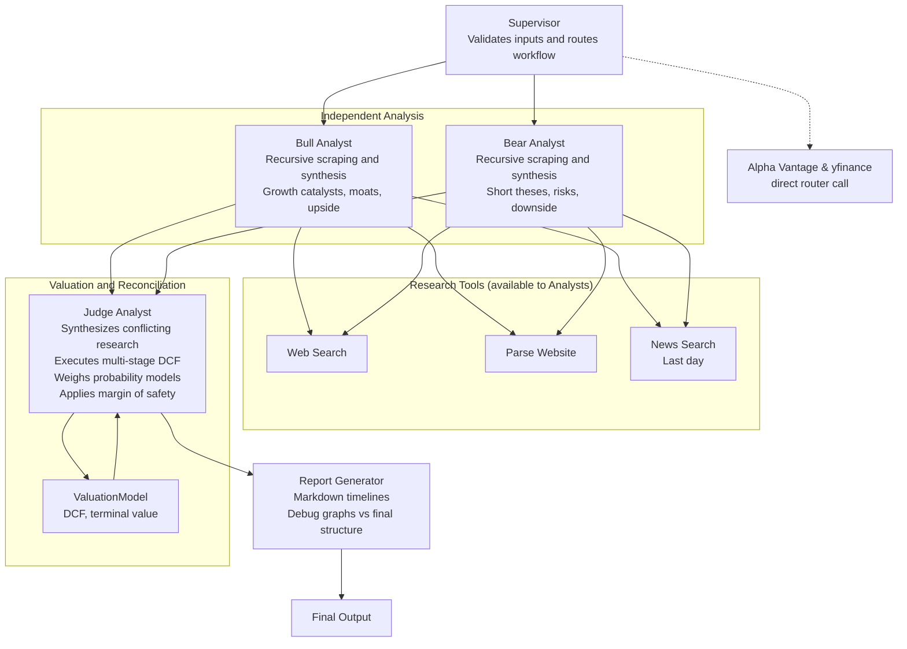

# Value Brief

Value Brief: Covering your assets. An automated daily digest that accumulates insights on your assets and tracks intrinsic value, margin of safety, and portfolio fundamentals.

## Why It Exists

**The Problem:** Rigorous fundamental analysis requires hours of manual data aggregation and modeling. Meanwhile, standard automated stock screeners lack the nuanced qualitative synthesis needed to determine a true margin of safety.

**The Solution:** Value Brief is an automated daily digest that acts as a personal team of investment analysts. By bridging the gap between generative AI and deterministic financial modeling, it translates complex, time-intensive research workflows into a streamlined pipeline that delivers actionable, fundamental-driven investment theses.

## Architecture

Value Brief is powered by an agentic research workflow orchestrated by LangGraph. It relies on specialised AI agents that operate iteratively and securely maintain state using Supabase PostgreSQL as a checkpointer.

- **Supervisor**: Controls workflow routing, validates inputs, and ensures all research parameters.
- **Bull Analyst**: Operates standalone with recursive web scraping and research tooling to synthesise growth catalysts, competitive moats, and upside cases.
- **Bear Analyst**: Utilizes matching toolsets independently to extract short theses, highlight speculative risks, downside scenarios, and mapping margin issues.
- **Judge Analyst**: Synthesizes conflicting fundamental researches, and leverages a configured `ValuationModel` to execute a multi-stage Discounted Cash Flow (DCF). Weighs probability models (Bear/Base/Bull), terminal value limits, and produces a reconciled final decision based strictly on margin of safety.
- **Report Generator**: Reconciles the output into isolated Markdown timelines (with segmented debug graphs vs presentation-ready final structures).

### Visualisation



## Sample Output Report

> Completed: 2026-04-12T01:06:59.965264

### Investment Report: Generic Corp (GNC)

### Investment Thesis

**Verdict** — Strong Buy on weakness, targeting a probability-weighted intrinsic value of approximately $408 per share.

**Rationale** — Generic Corp’s core investment case remains anchored in its entrenched enterprise workflow dominance and commercially indemnified AI architecture... the qualitative reality points to a deliberate monetization pivot from volume-based subscriptions to value-driven AI credit consumption. The current disconnect between Generic Corp’s durable cash generation and its compressed valuation multiple represents a classic transitional mispricing.

### Key Risks

- Accelerated enterprise seat consolidation outpacing AI credit monetization.
- Prolonged leadership vacuum delaying strategic capital allocation.
- Competitive disruption from AI-native platforms capturing mid-market share.

### DCF Valuation

| Scenario | Probability | Intrinsic Value | Margin of Safety |
| :------- | :---------- | :-------------- | :--------------- |
| Bear     | 25%         | $225.56         | -10.1%           |
| **Base** | **50%**     | **$380.93**     | **34.8%**        |
| Bull     | 25%         | $643.82         | 61.4%            |

**Expected Intrinsic Value:** $407.81  
**Current Price:** $248.39  
**Expected 5-Year CAGR:** 16.4%  
**Recommendation:** Strong Buy

---

## 🔗 Sources

- https://example.com/financials/gnc
- https://example.com/news/gnc-upgrades

---

## Getting Started

### Prerequisites

| Requirement                      | Version                                 |
| :------------------------------- | :-------------------------------------- |
| Python                           | `>= 3.14`                               |
| [uv](https://docs.astral.sh/uv/) | latest                                  |
| Supabase project                 | PostgreSQL (transaction pooler enabled) |
| LLM provider account             | OpenRouter / Google / Others            |

### 1. Clone the repository

```bash
git clone https://github.com/your-username/valuebrief.git
cd valuebrief
```

### 2. Install dependencies

Value Brief uses [`uv`](https://docs.astral.sh/uv/) for fast, reproducible dependency management.

```bash
# Install uv if you don't have it
curl -LsSf https://astral.sh/uv/install.sh | sh

# Create the virtual environment and install all dependencies
uv sync
```

This resolves dependencies from `pyproject.toml` and the pinned `uv.lock` file.

### 3. Configure environment variables

Copy the example file and fill in your credentials:

```bash
cp .env-example .env
```

Edit `.env` with the following values:

| Variable                     | Description                                                   |
| :--------------------------- | :------------------------------------------------------------ |
| `SUPABASE_CONNECTION_STRING` | Your Supabase PostgreSQL transaction-pooler connection string |
| `GOOGLE_API_KEY`             | Google Gemini API key (if using `langchain-google-genai`)     |
| `DEEPSEEK_API_KEY`           | DeepSeek API key                                              |
| `OPENROUTER_API_KEY`         | OpenRouter API key (used as the default provider)             |
| `ALPHAVANTAGE_API_KEY`       | Alpha Vantage key for financial data                          |
| `LANGSMITH_API_KEY`          | LangSmith key for tracing (optional but recommended)          |
| `*_PROVIDER` / `*_MODEL`     | Per-agent LLM provider and model overrides                    |

> **Tip:** Each agent (Bull, Bear, Judge, Supervisor, Report Generator, Valuation) has its own `_PROVIDER`, `_MODEL`, and `_TEMPERATURE` variable. 
> 
> Frontier models are strongly recommended for **Bull, Bear, and Judge analysts** for the best web search, reasoning, and tool calling capabilities. Success has been found using `qwen/qwen3.6-plus` with `0.2` temperature for excellent reasoning while remaining cost-effective.

### 4. Set up your portfolio

Create a `portfolio.json` file in the project root listing the tickers you want to track:

```json
{
  "tickers": ["AAPL", "GOOGL", "MSFT"]
}
```

See `example-portfolio.json` for reference.

### 5. Initialise the database

The checkpointer and valuation tables are created automatically on first run via `AsyncPostgresSaver.setup()`. Ensure your Supabase connection string points to a **transaction-pooler** endpoint (port `6543`) with `autocommit` enabled.

### 6. Run Value Brief

```bash
# Analyse tickers from portfolio.json
uv run python src/main.py

# Override tickers inline
uv run python src/main.py --tickers NVDA TSM ASML

# Point to a custom portfolio file
uv run python src/main.py --portfolio my-watchlist.json
```

Generated Markdown reports are written to the `logs/` directory.

### Scheduling (optional)

To run Value Brief as a daily digest, add a cron job:

```bash
# Example: run at 07:00 every day
0 7 * * * cd /path/to/valuebrief && uv run python src/main.py >> logs/cron.log 2>&1
```
