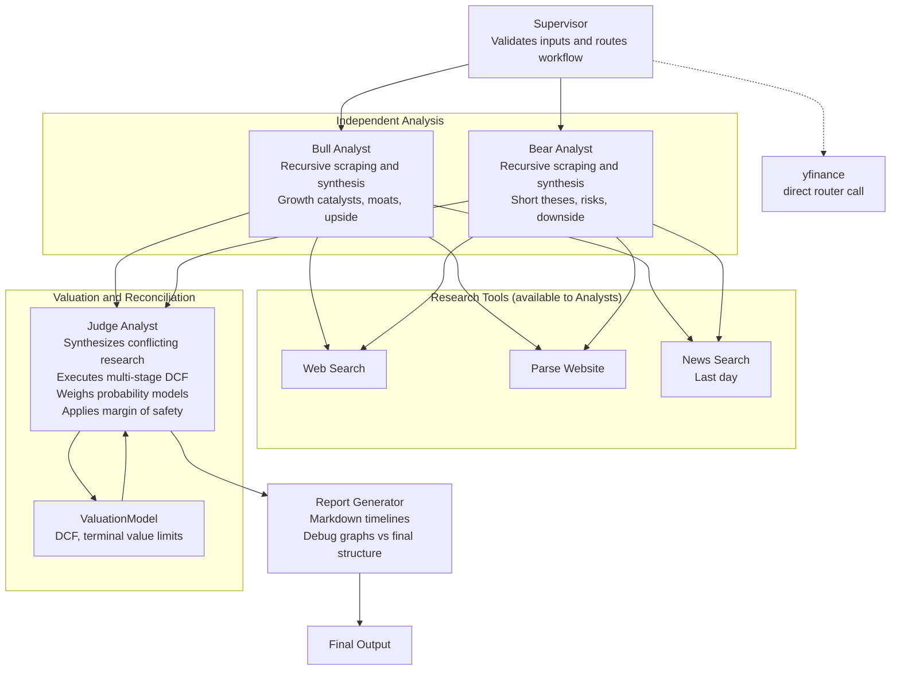

# Value Brief

Value Brief: Covering your assets. An automated daily digest that accumulates insights on your assets and tracks intrinsic value, margin of safety, and portfolio fundamentals.

## Architecture

Value Brief is powered by an agentic research workflow orchestrated by LangGraph. It relies on specialised AI agents that operate iteratively and securely maintain state using Supabase PostgreSQL as a checkpointer.

- **Supervisor**: Controls workflow routing, validates inputs, and ensures all research parameters.
- **Bull Analyst**: Operates standalone with recursive web scraping and research tooling to synthesise growth catalysts, competitive moats, and upside cases.
- **Bear Analyst**: Utilizes matching toolsets independently to extract short theses, highlight speculative risks, downside scenarios, and mapping margin issues.
- **Judge Analyst**: Synthesizes conflicting fundamental researches, and leverages a configured `ValuationModel` to execute a multi-stage Discounted Cash Flow (DCF). Weighs probability models (Bear/Base/Bull), terminal value limits, and produces a reconciled final decision based strictly on margin of safety.
- **Report Generator**: Reconciles the output into isolated Markdown timelines (with segmented debug graphs vs presentation-ready final structures).

### Visualisation

## Sample Output Report

> Completed: 2026-04-12T01:06:59.965264

══════════════════════════════════════════════════
INVESTMENT REPORT: Generic Corp (GNC)
══════════════════════════════════════════════════

### Investment Thesis

**Verdict** — Strong Buy on weakness, targeting a probability-weighted intrinsic value of approximately $408 per share.

**Rationale** — Generic Corp’s core investment case remains anchored in its entrenched enterprise workflow dominance and commercially indemnified AI architecture... the qualitative reality points to a deliberate monetization pivot from volume-based subscriptions to value-driven AI credit consumption. The current disconnect between Generic Corp’s durable cash generation and its compressed valuation multiple represents a classic transitional mispricing.

### Key Risks

- Accelerated enterprise seat consolidation outpacing AI credit monetization.
- Prolonged leadership vacuum delaying strategic capital allocation.
- Competitive disruption from AI-native platforms capturing mid-market share.

──────────────────────────────────────────────────
DCF VALUATION
──────────────────────────────────────────────────

| Scenario | Probability | Intrinsic Value | Margin of Safety |
| :------- | :---------- | :-------------- | :--------------- |
| Bear     | 25%         | $225.56         | -10.1%           |
| **Base** | **50%**     | **$380.93**     | **34.8%**        |
| Bull     | 25%         | $643.82         | 61.4%            |

**Expected Intrinsic Value:** $407.81  
**Current Price:** $248.39  
**Expected 5-Year CAGR:** 16.4%  
**Recommendation:** Strong Buy

---

## 🔗 Sources

- https://example.com/financials/gnc
- https://example.com/news/gnc-upgrades

---
