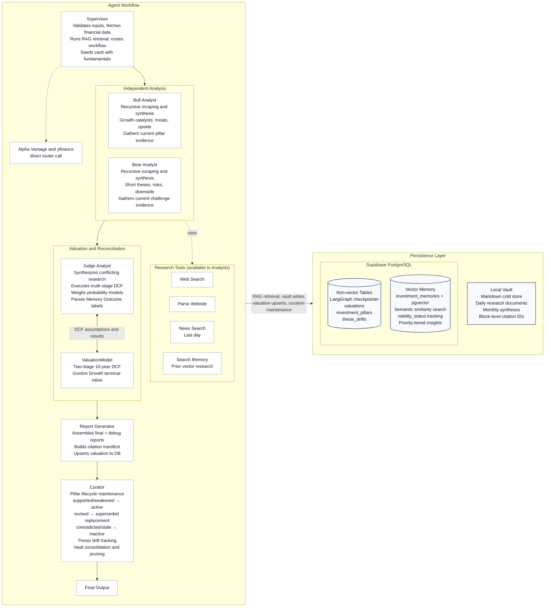
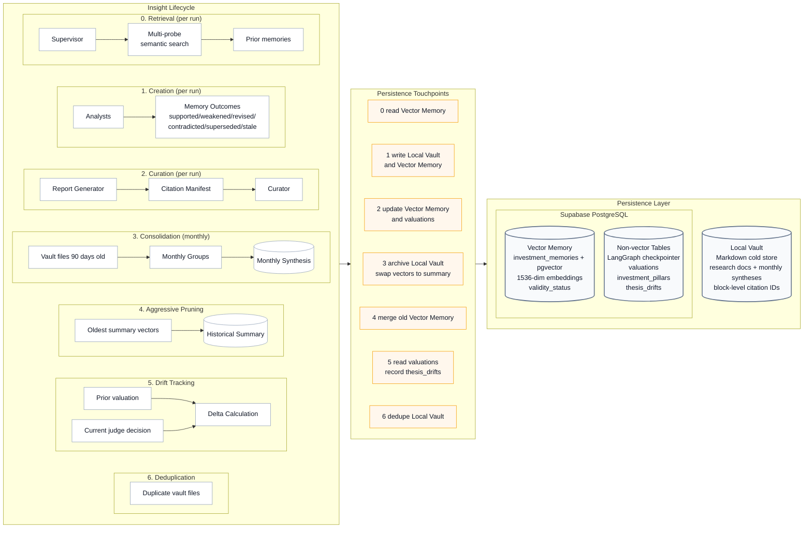

# Value Brief

Value Brief: Covering your assets. An automated daily digest that accumulates insights on your assets and tracks intrinsic value, margin of safety, and portfolio fundamentals.

## Why It Exists

**The Problem:** Rigorous fundamental analysis requires hours of manual data aggregation and modeling. Meanwhile, standard automated stock screeners lack the nuanced qualitative synthesis needed to determine a true margin of safety.

**The Solution:** Value Brief is an automated daily digest that acts as a personal team of investment analysts. By bridging the gap between generative AI and deterministic financial modeling, it translates complex, time-intensive research workflows into a streamlined pipeline that delivers actionable, fundamental-driven investment theses.

## Architecture

Value Brief is powered by an agentic research workflow orchestrated by LangGraph. It relies on specialised AI agents that operate iteratively and securely maintain state using Supabase PostgreSQL as a checkpointer.

- **Supervisor**: Controls workflow routing, validates inputs, fetches financial data, and runs a multi-probe RAG retrieval against prior research memories before dispatching to analysts. Retrieved memories serve as testable hypotheses, not accepted facts.
- **Bull Analyst**: Operates standalone with recursive web scraping and research tooling to synthesise growth catalysts, competitive moats, and upside cases. Can search prior vector memories via `search_investment_memory` and gather fresh evidence against prior pillars.
- **Bear Analyst**: Utilizes matching toolsets independently to extract short theses, highlight speculative risks, downside scenarios, and mapping margin issues. Identically capable of searching prior memories and gathering current challenge evidence.
- **Judge Analyst**: Synthesizes conflicting fundamental researches, leverages a configured `ValuationModel` to execute a multi-stage Discounted Cash Flow (DCF), and assigns pillar outcomes: supported, weakened, revised, contradicted, or stale. Weighs probability models (Bear/Base/Bull), terminal value limits, and produces a reconciled final decision based strictly on margin of safety.
- **Report Generator**: Reconciles the output into isolated Markdown timelines (with segmented debug graphs vs presentation-ready final structures). Builds citation manifests and upserts valuations to Supabase.
- **Curator**: Post-run knowledge maintenance agent. Manages the hybrid RAG lifecycle with outcome-aware citation logic — only `supported`/`weakened` memories get `is_cited=true` (survival signal); `contradicted`/`stale` memories are demoted with a `validity_status` that excludes them from future retrieval. Also prunes stale vectors, consolidates old vault files into monthly syntheses, tracks thesis drift, deduplicates content, and monitors vector storage health.

### Visualisation



## Sample Output Report

> Completed: 2026-04-12T01:06:59.965264

### Investment Report: Generic Corp (GNC)

### Investment Thesis

**Verdict** — Strong Buy on weakness, targeting a probability-weighted intrinsic value of approximately $408 per share.

**Rationale** — Generic Corp’s core investment case remains anchored in its entrenched enterprise workflow dominance and commercially indemnified AI architecture... the qualitative reality points to a deliberate monetization pivot from volume-based subscriptions to value-driven AI credit consumption. The current disconnect between Generic Corp’s durable cash generation and its compressed valuation multiple represents a classic transitional mispricing.

### Key Risks

- Accelerated enterprise seat consolidation outpacing AI credit monetization.
- Prolonged leadership vacuum delaying strategic capital allocation.
- Competitive disruption from AI-native platforms capturing mid-market share.

### DCF Valuation

| Scenario | Probability | Intrinsic Value | Margin of Safety |
| :------- | :---------- | :-------------- | :--------------- |
| Bear     | 25%         | $225.56         | -10.1%           |
| **Base** | **50%**     | **$380.93**     | **34.8%**        |
| Bull     | 25%         | $643.82         | 61.4%            |

**Expected Intrinsic Value:** $407.81  
**Current Price:** $248.39  
**Expected 5-Year CAGR:** 16.4%  
**Recommendation:** Strong Buy

---

## 🔗 Sources

- https://example.com/financials/gnc
- https://example.com/news/gnc-upgrades

---

## Hybrid RAG: Insight Lifecycle Management

Value Brief maintains a pillar-first knowledge store that grows smarter with each run. Fresh research is written to a **local Markdown vault** for full audit history, while Supabase stores pillar identity, lifecycle state, and compact vector-search rows. The Curator agent manages creation, revision, consolidation, pruning, and drift tracking so the system self-maintains and avoids bloat.

### Storage Architecture

| Layer                   | Storage                                                                                    | Purpose                                                                                                         | Retention                                              |
| :---------------------- | :----------------------------------------------------------------------------------------- | :-------------------------------------------------------------------------------------------------------------- | :----------------------------------------------------- |
| **Vault** (cold)        | `data/vault/{TICKER}/` plus `data/vault/{TICKER}/pillars/{pillar_id}.md`                  | Complete auditable record of research documents, source URLs, pillar dossiers, revision history, and citations | Indefinite (deduplicated by content hash)              |
| **Pillar Registry**     | `investment_pillars` table                                                               | Stable pillar identity, lifecycle status, current vector pointer, and dossier link                              | Current and historical pillar identities               |
| **Vector Memory** (hot) | `investment_memories` table — 1536-dim pgvector embeddings via `text-embedding-3-small`   | Compact semantic search rows for current pillars, drift checks, and summary consolidation                       | Actively pruned; compact rows only                     |

Apply `scripts/03-investment_pillars_ddl.sql` and then run `scripts/backfill_pillar_dossiers.py` to migrate existing thesis-pillar memories into the pillar registry and local dossier files.

### Lifecycle Stages



#### 0. Retrieval — Every Run (Before Research)

Before dispatching to analysts, the Supervisor queries the vector store for **prior research memories** on the current ticker:

- Embeds five fixed semantic probes targeting moat/growth, risks, valuation assumptions, thesis drift, and prior valuation.
- Merges results with a weighted scoring formula that rewards first-party, cited, and previously-supported memories.
- Default retrieval **excludes** memories previously labeled `contradicted`, `superseded`, or `stale` — these no longer compete for analyst attention. The thesis-drift probe can optionally include them to explain how the thesis changed.
- Retrieved memories are formatted into a structured `ResearchBrief` with inline vault citation strings and passed to analysts as **testable hypotheses**, not accepted facts.

#### 1. Creation — Every Run

- **Supervisor** fetches financial data via Alpha Vantage / yfinance and writes a fundamentals snapshot to the vault (`VaultWriter`).
- Analyst research findings (Bull + Bear) are written to the vault as timestamped, content-hashed Markdown documents.
- Each paragraph in a vault document receives a block ID (`^block-xxxxxxxx`), enabling granular citation.
- Insights are embedded via `text-embedding-3-small` (1536-dim) and stored in the `investment_memories` vector table with ticker-scoped metadata and a `source_priority` tier.
- The Judge labels each prior pillar with an outcome: `supported`, `weakened`, `revised`, `contradicted`, or `stale`. Contradicted outcomes must cite newer evidence that refutes the prior pillar.

#### 2. Curation — Every Run

After the report is generated, the **Curator** performs **outcome-aware** housekeeping:

1. **Citation Manifest**: Scans the final report for inline citation references (`(See: file.md#^block-id)`) and resolves each to its source paragraph in the vault.
2. **Outcome-Gated Citation Marking**: The Judge extracts Memory Outcome labels from both analyst theses. Only `supported` and `weakened` memories remain active — this is a **survival signal**, not a "mentioned" flag. `contradicted`, `superseded`, and `stale` memories are demoted via a `validity_status` metadata field, which excludes them from future retrieval.
3. **Delete Uncited Memories**: Vectors created within the active window (default 90 days) that were _not_ cited (and any with `validity_status = stale`) are deleted, preventing irrelevant embeddings from accumulating.

#### 3. Consolidation — Monthly

When vault files for a ticker exceed `CONSOLIDATION_CUTOFF_DAYS` (default 90 days), the Curator triggers consolidation:

- Groups vault files by month (`{YYYY-MM}`).
- Feeds each month's documents to the **curator LLM**, which synthesizes them into a structured `{YYYY-MM}_synthesis.md` file stored in the vault.
- Archives the original source files (marks them `archived: true` in frontmatter).
- **Atomic vector swap**: deletes all granular vector memories for that month and inserts a single summary vector with `source_priority = 2` and `is_cited = true`.

This ensures the vector index stays lean while preserving the full audit trail in cold storage.

#### 4. Aggressive Pruning — On Storage Pressure

When the `investment_memories` table exceeds the aggressive threshold (default 80% of 500 MB):

- The Curator identifies the oldest monthly summary vectors.
- Merges them via the curator LLM into broader historical summaries.
- Retains only the **3 most recent months** of summary vectors, deleting the rest.
- This is an emergency mechanism — it only fires when storage approaches the configured `DB_LIMIT_MB`.

#### 5. Thesis Drift Tracking

Every run that produces a new valuation is compared against the **prior valuation** stored in Supabase:

- Extracts the old and new verdicts (e.g., "Strong Buy" → "Buy").
- Calculates the delta percentage between old and new probability-weighted expected values.
- Extracts key risk changes from the judge's reconciliation output.
- Records the drift as a row in the `thesis_drifts` table: `(ticker, old_verdict, new_verdict, old_ev, new_ev, delta_pct, key_changes)`.

On a ticker's very first run, no prior valuation exists, so drift recording is skipped.

#### 6. Deduplication

The Curator scans the vault for files with identical SHA-256 content hashes. Within each duplicate group, the **earliest** file (by date in filename) is preserved and the rest are removed. This prevents redundant research documents from bloating the vault when the same URL is scraped across multiple runs.

### Citation & Outcome System

Value Brief uses a lightweight, file-based citation scheme combined with analyst-assigned outcome labels to maintain a self-correcting vector memory:

- **In the vault**: Every paragraph in a Markdown document is tagged with a block ID: `^block-a1b2c3d4`.
- **In the report**: Agents reference sources inline using the pattern `(See: 2026-05-02_a1b2c3d4.md#^block-a1b2c3d4)`.
- **Memory Outcomes**: Each analyst assigns every retrieved prior memory one of four labels — `supported`, `weakened`, `revised`, `contradicted`, or `stale`. The Judge parses these blocks and merges conflicting labels conservatively (e.g., `contradicted` beats `supported`).
- **At curation time**: the Curator keeps `supported` and `weakened` pillars active, turns revised prior rows into `superseded` rows with replacement pointers, and excludes `contradicted`, `superseded`, and `stale` pillars from normal retrieval without deleting the local dossier.
- **Retrieval feedback loop**: Memories labeled `contradicted`, `superseded`, or `stale` are excluded by default from subsequent retrieval runs, so they stop competing for analyst attention. The thesis-drift probe can optionally surface them when explaining how the thesis changed over time.

This creates a **provenance chain with outcome feedback**: report assertion → block ID → vault paragraph → vector embedding → analyst verdict → curation decision → future retrieval quality.

## Getting Started

### Prerequisites

| Requirement                      | Version                                 |
| :------------------------------- | :-------------------------------------- |
| Python                           | `>= 3.14`                               |
| [uv](https://docs.astral.sh/uv/) | latest                                  |
| Supabase project                 | PostgreSQL (transaction pooler enabled) |
| LLM provider account             | OpenRouter / Google / Others            |

### 1. Clone the repository

```bash
git clone https://github.com/your-username/valuebrief.git
cd valuebrief
```

### 2. Install dependencies

Value Brief uses [`uv`](https://docs.astral.sh/uv/) for fast, reproducible dependency management.

```bash
# Install uv if you don't have it
curl -LsSf https://astral.sh/uv/install.sh | sh

# Create the virtual environment and install all dependencies
uv sync
```

This resolves dependencies from `pyproject.toml` and the pinned `uv.lock` file.

### 3. Configure environment variables

Copy the example file and fill in your credentials:

```bash
cp .env-example .env
```

Edit `.env` with the following values:

| Variable                     | Description                                                   |
| :--------------------------- | :------------------------------------------------------------ |
| `SUPABASE_CONNECTION_STRING` | Your Supabase PostgreSQL transaction-pooler connection string |
| `GOOGLE_API_KEY`             | Google Gemini API key (if using `langchain-google-genai`)     |
| `DEEPSEEK_API_KEY`           | DeepSeek API key                                              |
| `OPENROUTER_API_KEY`         | OpenRouter API key (used as the default provider)             |
| `ALPHAVANTAGE_API_KEY`       | Alpha Vantage key for financial data                          |
| `LANGSMITH_API_KEY`          | LangSmith key for tracing (optional but recommended)          |
| `*_PROVIDER` / `*_MODEL`     | Per-agent LLM provider and model overrides                    |

> **Tip:** Each agent (Bull, Bear, Judge, Supervisor, Report Generator, Valuation) has its own `_PROVIDER`, `_MODEL`, and `_TEMPERATURE` variable.
>
> Frontier models are strongly recommended for **Bull, Bear, and Judge analysts** for the best web search, reasoning, and tool calling capabilities. Success has been found using `qwen/qwen3.6-plus` with `0.2` temperature for excellent reasoning while remaining cost-effective.

### 4. Set up your portfolio

Create a `portfolio.json` file in the project root listing the tickers you want to track.

**International Stocks:** Use the [Yahoo Finance convention](https://help.yahoo.com/kb/finance-for-web/SLN2310.html) (`TICKER.EXCHANGE`) for all tickers.

```json
{
  "tickers": ["AAPL", "MZH.SI", "9988.HK", "RY.TO"]
}
```

#### Exchange Mappings (Alpha Vantage)

Since Alpha Vantage uses different exchange suffixes than Yahoo Finance, Value Brief uses a mapping file to translate them during data retrieval. You can customise these mappings in `exchange_mappings.json`:

```json
{
  "yahoo_to_alphavantage": {
    ".SI": ".SIN",
    ".HK": ".HKG",
    ".TO": ".TRT"
  }
}
```

> [!NOTE]
> Alpha Vantage often lacks fundamental data (`OVERVIEW`) for international stocks. In such cases, Value Brief automatically falls back to `yfinance` to ensure your report remains complete.

See `example-portfolio.json` for reference.

### 5. Initialise the database

The checkpointer and valuation tables are created automatically on first run via `AsyncPostgresSaver.setup()`. Ensure your Supabase connection string points to a **transaction-pooler** endpoint (port `6543`) with `autocommit` enabled.

### 6. Run Value Brief

```bash
# Analyse tickers from portfolio.json
uv run python src/main.py

# Override tickers inline
uv run python src/main.py --tickers NVDA TSM ASML

# Point to a custom portfolio file
uv run python src/main.py --portfolio my-watchlist.json
```

Generated Markdown reports are written to the `logs/` directory.

### Scheduling (optional)

To run Value Brief as a daily digest, add a cron job:

```bash
# Example: run at 07:00 every day
0 7 * * * cd /path/to/valuebrief && uv run python src/main.py >> logs/cron.log 2>&1
```
